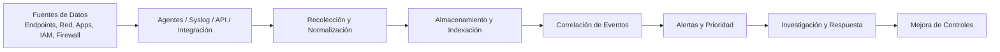

# SIEM (Security Information and Event Management)

<div class="term-meta-box">
  <div class="term-meta-item">
    <span class="term-meta-label">Categoría</span>
    <span class="term-meta-value">Monitorización, SOC y Respuesta a Incidentes</span>
  </div>
  <div class="term-meta-item">
    <span class="term-meta-label">Autor</span>
    <span class="term-meta-value"><a href="https://github.com/cibercelia" target="_blank">@cibercelia</a></span>
  </div>
</div>

## 📖 Definición

El **SIEM** (*Security Information and Event Management*) es una solución de seguridad operativa que reúne, normaliza, almacena y analiza registros e información de seguridad procedentes de múltiples fuentes dentro de una organización: firewalls, servidores, endpoints, aplicaciones, redes, dispositivos de red, identidades y soluciones de detección avanzada. Su objetivo es proporcionar visibilidad del estado de seguridad, detectar patrones sospechosos y facilitar la investigación y respuesta ante incidentes.

En la práctica, un SIEM no solo registra eventos: también los correlaciona para identificar actividad maliciosa, descartar ruido, priorizar alertas y apoyar al equipo de seguridad en la toma de decisiones. Es una pieza clave dentro de un **SOC** (*Security Operations Center*), donde convierte grandes volúmenes de telemetría en inteligencia operativa útil.

!!! note "Nota importante"
    Un SIEM no sustituye la prevención; complementa la seguridad con vigilancia, detección y respuesta. Sin fuentes de datos bien integradas y reglas de correlación adecuadas, la visibilidad real puede quedar incompleta.

---

## ⚙️ ¿Cómo funciona? / Principios Fundamentales

Un SIEM suele seguir un flujo operativo basado en la recopilación, normalización, correlación y respuesta:



1. **Recogida de telemetría**: El SIEM ingiere eventos desde servidores, aplicaciones, DNS, proxy, EDR, firewall, identidad, bases de datos y otros sistemas relevantes.
2. **Normalización y enriquecimiento**: Los datos se transforman a un formato común y se enriquecen con información contextual, como IPs, usuario, dispositivo, geolocalización, severidad y comportamiento histórico.
3. **Correlación y detección**: Las reglas de seguridad comparan eventos para detectar indicadores de compromiso, anomalías, patrones de acceso inusuales o ataques conocidos.
4. **Alertado y priorización**: Cuando se activa una regla, el sistema genera alertas con contexto, priorización y rutas de investigación para que el equipo de seguridad actúe con criterio.
5. **Investigación y respuesta**: Los analistas utilizan el SIEM para reconstruir secuencias de eventos, confirmar incidentes y coordinar acciones con otras herramientas como EDR, NAC, firewall o SOAR.

---

## 🎯 Ejemplo Práctico o Escenario de Demostración

Supongamos que una organización detecta un intento de acceso no autorizado a una cuenta privilegiada. El SIEM puede correlacionar varios eventos en segundos:

=== "🔴 Señales de alarma"

    ```text
    10:12:34  host=web-01  src_ip=198.51.100.20  event=authentication_failure user=admin
    10:12:38  host=web-01  src_ip=198.51.100.20  event=authentication_failure user=admin
    10:12:42  host=web-01  src_ip=198.51.100.20  event=authentication_failure user=admin
    10:12:49  host=web-01  src_ip=198.51.100.20  event=login_success user=admin
    10:12:50  host=web-01  src_ip=198.51.100.20  event=privilege_escalation user=admin
    ```

=== "🟢 Regla de detección"

    ```yaml
    title: "Intento de acceso a cuenta privilegiada con múltiples fallos y posterior éxito"
    logsource:
      product: windows
    detection:
      selection:
        event_id:
          - 4625
          - 4624
      condition: |
        (count(event_id=4625 by user) >= 3 and event_id=4624 and user="admin")
    level: high
    ```

En este caso, el sistema detecta una secuencia sospechosa: varios fallos de autenticación, un acceso posterior exitoso desde una IP externa y un posible abuso de privilegios. El analista puede investigar si se trata de fuerza bruta, acceso comprometido o una actividad legítima con anomalías.

---

## 🛡️ Medidas de Mitigación y Buenas Prácticas

- [x] **Definir fuentes de datos críticas**: Integrar todos los sistemas relevantes: identidad, endpoints, firewall, DNS, VPN, proxy, nube, EDR y aplicaciones clave.
- [x] **Normalizar y enriquecer eventos**: Asegurar que los registros compartan un formato consistente, con contexto suficiente para la investigación.
- [x] **Diseñar reglas de detección eficaces**: Evitar falsos positivos excesivos y centrarse en comportamientos y secuencias de ataque relevantes.
- [x] **Priorizar la retención y capacidad de búsqueda**: Los datos deben mantenerse durante el periodo suficiente para permitir forense y cumplimiento regulatorio.
- [x] **Integración con respuesta automatizada**: Combinar SIEM con SOAR o automatizaciones para aislar endpoints, bloquear accesos o cerrar cuentas ante detecciones críticas.
- [x] **Supervisión y tuning continuo**: Revisar reglas, alertas y calidad de datos con regularidad para adaptarse a la amenaza y a los cambios del entorno.

---

## 🔗 Referencias y Enlaces de Interés

- [NIST SP 800-92: Guide to Computer Security Log Management](https://csrc.nist.gov/publications/detail/sp/800-92/final)
- [OWASP Security Logging Cheat Sheet](https://cheatsheetseries.owasp.org/cheatsheets/Logging_Cheat_Sheet.html)
- [MITRE ATT&CK: Detection & Response](https://attack.mitre.org/resources/)
- [Maturity Model for SOC Capability](https://www.microsoft.com/en-us/security/business/solutions/security-operations-center)
